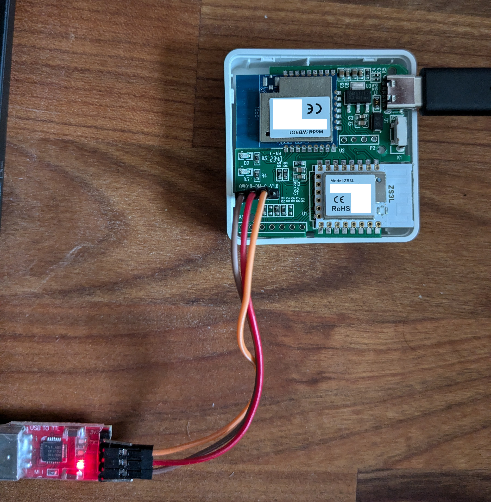
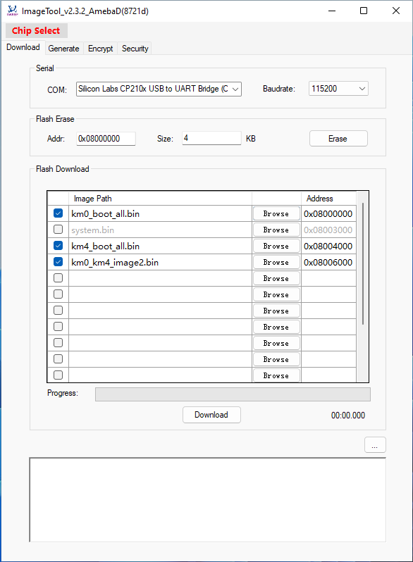

# AmebaD SDK adjusted for Tuya GW018-DM gateway
The purpose of this is to cut the GW108-DM gateway from the cloud and use it as Zigbee Adapter in HomeAssistant (e. g. via Zigbee2MQTT). The firmware is basically the same as https://github.com/parasite85/rtl_firmware, but with some small adjustments for AmebaD (WBRG1 module, RTL8721CSM) instead of Ameba1 (WRG1 module, RTL8711AM) based on the discussion [here](https://github.com/MattWestb/EFR32-FW/issues/6).

**Work in Progress! Use this at your own risk! And consider making a backup before!**

## 1) Connect to the device via UART
Open up the plastic case and remove the single screw. Solder pin headers to the PCB in P1 area. Connect them with jumper cables to a UART-TTL to USB adapter. Pin assignment is from left (outer edge) to right:

* GND -> connect to GND on UART adapter
* TX -> connect to RX on UART adapter
* RX -> connect to TX on UART adapter
* VCC (?) -> don't connect anything here



Plugin the UART-TTL to USB adapter into your computer's USB port.

## 2) Make a backup of the Realtek's chip external flash
You need to get into a special "command mode" in order to create a backup. We need to communicate to the gateway via UART to do that. I'm using minicom for that purpose:
```
# install it first – use your system's package manager
sudo dnf install minicom
# now start it and connect to the gateway – use the right device path, in my case it's /dev/ttyUSB0
minicom -b 115200 -D /dev/ttyUSB0
```
If you plug in the UART adapter into your computer's USB port and connect the gateway to power afterwards, you will see the boot messages of your gateway flickering on the screen. 

You'll have to do it the other way round in order to get into the command mode: Leave minicom open, unplug the gateway from power and the UART adapter from your PC – then reconnect it: This time power on the gateway first and plugin the UART adapter second. You will see nothing but a blinking cursor – but that's how it should be!

Now enter minicom settings (pressing "ctrl" + "a" and then "o") and disable hardware flow control by entering "Serial port setup" and pressing "f". Press enter, close settings. Now press and hold ESC – if everything works fine, a shell "#" will pop up. You can type in "?" and press enter to see a list of available commmands:
```
#?
----------------- COMMAND MODE HELP ------------------
        HELP (?) 
                 Print this help messag

        DW 
                 <Address, Hex> <Len, Dec>: 
                 Dump memory word or Read Hw word register
        EW 
                 <Address, Hex> <Value, Hex>: 
                 Write memory word or Write Hw word register 
                 Can write one word at the same time 
                 Ex: EW Address Value0 Value1
        FLASH 
                 erase chip 
                 erase sector addr 
                 erase block addr 
                 read addr len 
                 write addr data 

        EFUSE 
                 wmap addr len data
                 rmap 
                 autoload 

        REBOOT 
                 <item, string> : 
                 item: uartburn or N/A 
                 

----------------- COMMAND MODE END  ------------------
#
```
We want to make a dump of the flash – so the "flash read" command would be the right one. But wait: We have to save the output somewhere. So press "ctrl" + "a" again followed by "l" to save minicom log in a file. Name it like you want and press enter. Let's read the flash (found address and length by trial and error):
```
flash read 0 2097152
```
And the flash will be printed as hex code on your screen. This might take a while. Have a coffee or a nap in the meantime. Exit minicom afterwards by pressing "ctrl" + "a" followed by "x", open the logfile in a text editor, make sure you only keep the dump (starting with `00000000:` and ending with `007ffff0: 7c8bfc05 b410f5f8  14a25132 5f239f20` in my case) and save it. Then convert it into a binary file (maybe there is a much cleaner way to do this – I just could'nt find any):
```
awk -F' ' '{print $2$3$4$5}' myfirmwaredump.cap | xxd -r -p | xxd -e | awk -F' ' '{print $2$3$4$5}' | xxd -r -p wbrg1-firmware.bin
```
Congratulations! You now have a backup and theoretically you can restore it (or parts of it) using ImageTool in case anything goes wrong.

## 3) Build the new firmware
Now it's time to clone this repo, install the needed dependencies and build the gateway's new firmware out of the AmebaD sdk :)
```
sudo dnf install make glibc-devel.i686 ncurses-compat-libs.i686 
git clone https://github.com/jasperw1996/ambd_sdk_GW018-DM
cd ambd_sdk_GW018-DM/project/realtek_amebaD_va0_example/GCC-RELEASE/project_lp/
make all
cd ../project_hp/
make all
```
If everything goes fine, you should see a `========== Image manipulating end ==========` at the end of the make process. If you get an "error 127", you may need to change some permissions:
```
chmod -R 777 ./
chmod -R 777 ../project_hp/
```
Then clean up the environment with `make clean` and try again. Finally you'll have a bunch if images in the `/adsk/image` subdirectory of `project_lp` and `project_hp`. We'll need three of them in the next step to flash the new firmware to the gateway.

## 4) Flash the firmware to the gateway
You can flash the new firmware to the gateway using Realtek ImageTool – there is a GUI for windows, but you might also use the Linux CLI from AmebaD Arduino SDK. Choose whatever you prefer :)

### a) Flash using ImageTool CLI (Linux)
Download the [CLI executable from AmebaD Arduino SDK](https://github.com/ambiot/ambd_arduino/raw/dev/Arduino_package/ameba_d_tools_linux/upload_image_tool_linux). Grab `km0_boot_all.bin` from `project_lp` as well as `km4_boot_all.bin` and `km0_km4_image2.bin` from `project_hp` out of your build's image folders and put them in the same directory as the ImageTool executable. 

The ImageTool for Linux can put your device into UART download mode automatically. All you have to do is connecting your gateway to your computer like you did before: Power up the gateway first and plugin the USB UART adapter to your computer afterwards. Then start flashing (make sure that your USB UART adapter supports a baudrate of `921600`):
```
# make the executable executable if you have not done so before:
chmod +x upload_image_tool_linux

# Erase flash before flashing new firmware (may not be needed)
./upload_image_tool_linux "$PWD" /dev/ttyUSB0 ameba_rtl8721csm Enable Enable 921600

# … and let's flash!
./upload_image_tool_linux "$PWD" /dev/ttyUSB0 ameba_rtl8721csm Enable Disable 921600
```
You can see in the logs if the flashing process went well. If not – just flash it again, as long as you stay in `UART_DOWNLOAD` mode, everything should be fine. Make sure that flashing succeeded, then power off the gateway. Fire up minicom and power on the gateway again. You should see some boot logs again, containing `!!!!!!!!!!!!!!!! Hello from KM0 !!!!!!!!!!!!!!!!!!!!!!` and `!!!!!!!!!!!!!!!! Hello from KM4 1!!!!!!!!!!!!!!!!!!!!!!`. After a few seconds, you'll get a shell and can connect to your WiFi.

### b) Flash using ImageTool GUI (Windows)

To prepare the flashing process you will have to reenter "Command Mode". Then, in minicom, after disabling hardware flow control again, type in `reboot uartburn` and press enter to put the device into `UART_DOWNLOAD` mode.

In the next step, you'll need a Windows 7 (+) environment to make use of the [ImageTool.exe from the original AmebaD SDK repo](https://github.com/ambiot/ambd_sdk/raw/dev/tools/AmebaD/Image_Tool/ImageTool.exe). Use a virtual machine or a Windows installation on a different device.

Install .NET Framework 3.5, the drivers for your UART adapter and open ImageTool.exe. Click "Chip Select" and choose "AmebaD". Set baudrate to `115200` or `921600` (faster), if your UART USB adapter supports it. If your gateway is still in `UART_DOWNLOAD` mode and all drivers are installed correctly, you should see your UART adapter as a COM port.

The new firmware is smaller than the old firmware, that's why I erased some parts of the flash manually – this may not be needed, but I think it's "cleaner" (?):
1) Erase 16 KB starting from `0x08000000`
2) Erase 8 KB starting from `0x08004000`
3) Erase 1224 KB starting from `0x08006000`

Now grab `km0_boot_all.bin` from `project_lp` as well as `km4_boot_all.bin` and `km0_km4_image2.bin` from `project_hp` out of your build's image folders, put them on your Windows machine and select them in ImageTool:



Click on "Download", wish the best and wait a minute :) You can see in the logs if the flashing process went well. If not – just flash it again, as long as you stay in `UART_DOWNLOAD` mode, everything should be fine. Make sure that flashing succeeded, then power off the gateway. Connect it to your Linux machine again, fire up minicom and power on the gateway. You should see some boot logs again, containing `!!!!!!!!!!!!!!!! Hello from KM0 !!!!!!!!!!!!!!!!!!!!!!` and `!!!!!!!!!!!!!!!! Hello from KM4 1!!!!!!!!!!!!!!!!!!!!!!`. After a few seconds, you'll get a shell and can connect to your WiFi.


## 5) Connect your gateway to WiFi
At this point, the procedure is nearly identical to the [WRG1 hack](https://github.com/parasite85/tuya_tygwzw1_hack). Type in your WiFi SSID, your passphrase and connect:
```
ATW0=myWifiName
ATW1=myWifiPassword
ATWC

# copy your gateway's IP address out of the log –
# you'll need it in the next step!
# … and maybe reboot afterwards

reboot
```

## 6) Use your gateway as adapter in Zigbee2MQTT

After a reboot, your gateway will automatically connect to your WiFi and prepare everything needed to use it as an adapter in Zigbee2MQTT.

Make sure you see `Example: socket tx/rx 1` in the logs. Then open Zigbee2MQTT configuration in HomeAssistant and fill in the details for your adapter (take the IP you got from the logs in step 5):
```
serial:
  adapter: ezsp
  baudrate: 115200
  port: tcp://<your-gateway-ip>:80
  rtscts: true
```
Start the Zigbee2MQTT addon – and it will try to connect to your gateway. For me, this is working pretty stable now. If you get an error like this, wait a few seconds, restart the addon and try again until it's working :)
```
[2024-07-31 15:33:25] error: 	zh:ezsp:uart: --> Error: Error: {"sequence":-1} after 10000ms
Error: Failure to connect
    at SerialDriver.resetForReconnect (/app/node_modules/zigbee-herdsman/src/adapter/ezsp/driver/ezsp.ts:341:19)
    at SerialDriver.emit (node:events:517:28)
    at /app/node_modules/zigbee-herdsman/src/adapter/ezsp/driver/uart.ts:344:22
    at Queue.execute (/app/node_modules/zigbee-herdsman/src/utils/queue.ts:35:20)
    at Socket.<anonymous> (/app/node_modules/zigbee-herdsman/src/adapter/ezsp/driver/uart.ts:152:17)
```
## 7) Update your gateway over-the-air
After flashing this firmware to your gateway, you can update/push new firmware files to your device via WiFi. Please note that you have to update the WBRG1 module (the one this repo is made for) and the ZS3L module separately.

### a) Update WBRG1 module

For updating the WBRG1's Realtek chip, I enabled the [OTA update example](https://github.com/jasperw1996/ambd_sdk_GW018-DM/blob/dev/component/common/example/ota_http/example_ota_http.c) and changed a few lines. (If you don't need it, you can disable it by setting `CONFIG_EXAMPLE_OTA_HTTP` to `0` in [platform_opts.h](https://github.com/jasperw1996/ambd_sdk_GW018-DM/blob/dev/project/realtek_amebaD_va0_example/inc/inc_hp/platform_opts.h)).

Set the `HOST` variable in the [OTA update example](https://github.com/jasperw1996/ambd_sdk_GW018-DM/blob/dev/component/common/example/ota_http/example_ota_http.c) to the IP address or hostname of your computer. Then rebuild the firmware. Go to the image folder in `project/realtek_amebaD_va0_example/GCC-RELEASE/project_hp/asdk/image`, open a terminal there and start a webserver of your choice serving that directory:
```
# use a simple python http server …
python3 -m http.server 8080

# … or maybe NGINX with docker or podman
podman run --rm -it --name nginx-firmware-server -p 8080:80 -v ../image:/usr/share/nginx/html:ro docker.io/nginx:stable
```
Now start the gateway, wait until the blue LED stops blinking, press the reset button for 3-4 seconds and release. You should see your gateway connecting to your webserver a few seconds later, downloading the `OTA_All.bin` firmware file in your image folder. It reboots automatically afterwards – and if everything worked fine, you should see the blue LED blinking for a few seconds again.

### b) Update ZS3L module
Now that your Zigbee chip's UART connection is exposed via WBRG1 module to your WiFi, you can update its firmware over-the-air, too. We could use the good old "xmodem" protocol for that. 

If you want to learn more about that, you could enter the bootloader of your Zigbee chip manually and use "xmodem" directly, e. g. with minicom. But there are also a bunch of tools out there to automate this. I successfully tried NabuCasa's [Universal Silabs Flasher](https://github.com/NabuCasa/universal-silabs-flasher):
```
universal-silabs-flasher --device socket://<your-gateway-ip>:80 flash --firmware "/path/to/your/gecko-bootloader-firmware-file.gbl"
```
I built a new, but still buggy firmware (and also created a .gbl file of the stock firmware you can flash back) [here](https://github.com/MattWestb/EFR32-FW/issues/6#issuecomment-2275368851). But you could also create one yourself using "Simplicity Studio" (to create a .bin file) and "Simplicity Commander" (to convert the .bin to .gbl afterwards).

For me, the flashing process hangs at 100% – it seems to work fine, though: If I wait only a few seconds and the repower the device, the Zigbee chip boots up with the new firmware.

**Please note that there is always a risk that you can (soft-)brick your device while flashing a new firmware to it. Do it at your own risk! You might need your USB UART adapter again or an SWD debugger for the ZS3L module in case anything goes wrong.**